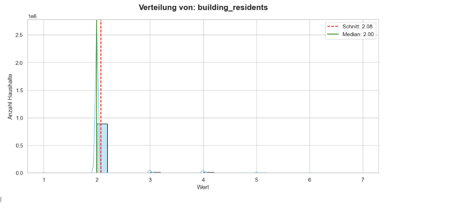
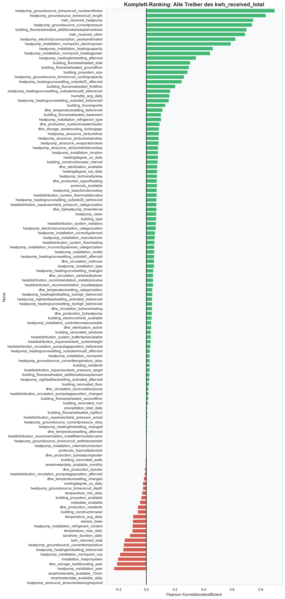

# Interpretation der Plots

In einem ersten Schritt wurden alle metrischen Variablen und deren Zusammenhang betrachtet. Hierbei wurde sich fokussiert wie das Wetter, der Marktpreis, die Wärmepumpe sowie die PV Einspesiugn den Gesamtverbrauch beeinflussen. 
Die Gurndsätzliche Annahme ist, dass ein zunehmender Verbrauch der Wärmepumpe auch den Gesamtverbrauch erhöhte.Der Verbrauch der Wärmepumpe wird dabei durch kältere Temperaturen erhöht. Diesen Zusammenhang sieht man im ersten Plot deutlich. 
So sinkt bei einem Anstieg der Durchschnitts Temperatur auch der kwh Verbrauch der Wärmepumpe (WP). Auch für den Gesamtverbrauch lässt sich dieser Zusammenhang beobachten. Anhand der Farbskala wird aber auch deutlich, dass sich dieser Zusammenhang besonders in der Heizperiode von Oktober bis März beobachten lässt.Demnsprechend beeinflusst ein höherer Verbrauch der Wärmepumpe auch stärker den Gesamtverbrauch eines Haushaltes wie Plot 3 zeigt. 

Ein weiterer Einflussfaktor bidlet der Preis. Im Zuge der Ukraine Krise kann ein starker Anstieg im Strompreis beobachtet werden (siehe Grafik2). Im Scatterplot wird auich klar, dass ein leicht negativer zusammenhang zwischen dem Preis und dem Vebrrauch vorliegt. Dies scheint sich aber auf hohe Preiswerte in den SommermonatEN zurückführen lassen. Man sieht die Punkte sehr deutlich am unteren Rand der Grafik. 
Dahingegen wirkt die Einspeisung einer PV Anlage negativ auf den Verbrauch. So sinkt der Vebrrauch bei einem Anstieg der PV Einspeisung in den Sommermonaten. Denn bevor Strom in das Netz eingespeist wird, wird es zuerst verbraucht. Somit hat eine PV Anlage in einem Haushalt einen geringeren Nezubezug zur folge. 

Schaut man sich den Zusammenhang der Faktoren auf den Verbrauch noch im Zeiterverlauf genauer an, werden die Interpretationen noch deutlicher. So sieht man deutlich, dass Verbrauchspeaks in der kalten Jahreszeit auftauchenen. Der Anteil der Wärmepumpe spielt dabei allerdings nur eine geringe Rolle wie der letzte Zeitverlauf Plot zeigt. Demnach scheint der Stromverbrauch weniger stark durch den Verbrauch einer Wärmepumpe beeinflusst zu werden. Für die Solareinspeisung und die Preisentwicklung lässt sich wiederum die vorherige Interpretation übernehmen. Der Preispeak im zweiten Halbjahr 2022 ist deutlich zu sehen.

Neben eden bereits interpretierten Faktoren liefern aber auch Charakteristika über die Immobilien und den Haushalt Informationen zum vebrrauch. So wird deutlich, dass Höuser die keine sanierten Fenster, eine Fassade oder ein Dach haben einen höheren Energieverbrauch aufweisen. Gleichwohl zeigt aber auch der vierte Plot, dass der Anteil der sanierten Höuser deutlich geringer Ausfällte. Somit haben wir weniger Beobachten die eine Sanierung vorgenommen haben im Vergleich zu denen die eine Sanierung vorgenommen haben. Neben dem Einfluss des Gebäudezustand hat aber auch die Fläche einen postiven Einfluss auf den Verbrauch. Bei einem Anstieg der Wohnfläche steigt also der Verbrauch.

Für die Verteilung des Verbrauchs auf die Anzahl der Bewohner wird wiederum ersichtlich, dass der meiste Strom in zwei Personen Haushalten verbraucht wird. Dies ist insofern aber auch nicht verwunderlich, da auch die meisten Haushalte in den Daten Zweipersonen Haushalte sind.

Neben den bereits interpretierten Faktoren liefern auch spezifische Charakteristika der Immobilien und der Haushalte wesentliche Informationen zum Verbrauch.

In der Korrelationsanalyse wird deutlich, dass Häuser ohne sanierte Fenster, Fassaden oder Dächer einen systematisch höheren Energieverbrauch aufweisen. Der Sanierungsstatus fungiert hierbei als einer der stärksten negativen Korrelatoren: Je umfassender die thermische Hülle ertüchtigt wurde, desto niedriger liegt das Basisniveau des Strombezugs.Gleichwohl zeigt die Bestandsanalyse, dass der Anteil der sanierten Häuser im Portfolio deutlich geringer ausfällt. Wir verfügen somit über wesentlich weniger Beobachtungen von sanierten Objekten im Vergleich zu jenen im Originalzustand. Diese Ungleichverteilung im Datensatz unterstreicht das enorme Optimierungspotenzial innerhalb der untersuchten Flotte.

Neben dem Einfluss des Gebäudezustands hat die beheizte Fläche den erwartungsgemäß stärksten positiven Einfluss auf den Verbrauch. Mit jedem Anstieg der Wohnfläche skaliert auch der Energiebedarf, da die zu deckende Transmissionswärmelast linear mit der Gebäudegeometrie wächst.Ergänzend dazu zeigt sich beim Nutzerverhalten ein ähnliches Bild: Eine höhere Anzahl an Bewohnern führt zu einem Anstieg der Grundlast, was primär auf die Warmwasseraufbereitung und den allgemeinen Haushaltsstrom zurückzuführen ist. In der Kombination dieser Faktoren lassen sich so klare Lastprofile ableiten, die als Basis für eine intelligente Steuerung dienen.

