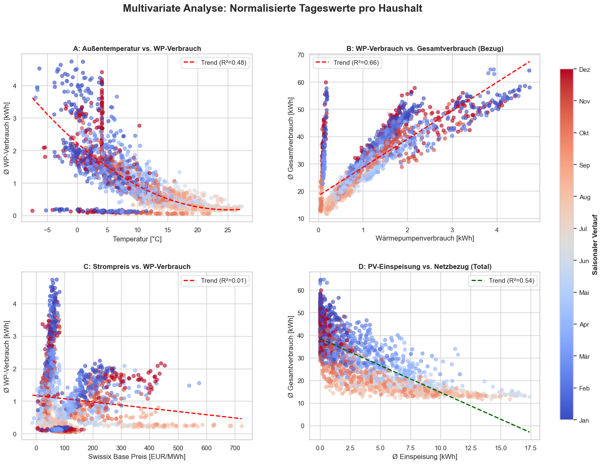

# Der Bar-Plot (Einfluss-Ranking)

Diese Grafik zeigt dir, welche Merkmale den größten "Hebel" auf den Stromverbrauch haben.

- Positive Korrelation (Grüne Balken nach rechts):
- Hier stehen meist Variablen wie building_floorareaheated_total oder building_residents. Das ist logisch: Mehr Fläche und mehr Personen bedeuten fast immer einen höheren Grundverbrauch.
- Spannend sind technische Faktoren: Wenn z.B. heatpump_heatingcurvesetting_toohigh_beforevisit stark positiv korreliert, hast du den Beweis, dass eine falsch eingestellte Heizkurve den Gesamtverbrauch messbar nach oben treibt.

Sanierungseffekte: Variablen wie building_renovated_windows oder building_renovated_walls sollten hier auftauchen. Ein Wert von -0.3 bedeutet beispielsweise, dass sanierte Gebäude im Schnitt einen deutlich geringeren Netzbezug haben.
PV-Systeme: building_pvsystem_available sollte stark negativ korrelieren. Das bedeutet: Das Vorhandensein einer PV-Anlage senkt den externen Netzbezug (kwh_received_total) drastisch, da Eigenstrom genutzt wird.

# Die Top-15 Heatmap (Inter-Korrelation)

- Diese Matrix ist der "Deep Dive". Sie zeigt nicht nur, was den Verbrauch beeinflusst, sondern auch, wie die Merkmale untereinander zusammenhängen.
- Multikollinearität (Dunkle Quadrate abseits der Hauptdiagonale):
- Oft korrelieren Sanierungsmaßnahmen untereinander (wer die Fenster macht, macht oft auch das Dach). Wenn renovated_windows und renovated_roof eine Korrelation von 0.8 haben, reicht es für dein ML-Modell oft aus, nur eine dieser Variablen zu nutzen.

Der "Effizienz-Cluster":

Suche nach dem Bereich, in dem heatpump_technicallyokay oder heatpump_clean liegen. Wenn diese positiv mit einem niedrigeren Verbrauch (negativ korreliert mit kwh_received_total) zusammenhängen, belegst du schwarz auf weiß, dass Wartung eine Form von Energieeinsparung ist.

# Was das für deinen "SmartHeat-Optimizer" bedeutet

- Aus den Plots lassen sich drei Kern-Erkenntnisse für dein Projekt ableiten:
- Identifikation von "Sorgenkindern": Haushalte mit hohem Verbrauch bei gleichzeitig hohem Wert für heatpump_heatingcurvesetting_toohigh sind deine primäre Zielgruppe für den Optimizer.
- Datenbereinigung: Variablen, die im Bar-Plot nahe 0 liegen (z.B. heatpump_installation_internetconnection), haben keinen Einfluss auf den Stromverbrauch. Diese kannst du im Modell weglassen, um es einfacher und robuster zu machen.
- Hebelwirkung: Du kannst nun quantifizieren: "Eine Optimierung der Heizkurve (Senkung) korreliert stärker mit einer Verbrauchsminderung als der Austausch von Fenstern in einem bereits teilsanierten Haus."

. Die Zeitreihen-Analyse (Monitoring & Qualität)Dies ist die Basis. Hier sehen wir, wie das System über das Jahr "atmet". Die grauen Balken (Heizperiode) erklären die massiven Lastspitzen im Winter.Erkenntnis: Die Wärmepumpe dominiert das Lastprofil fast vollständig.Daten-Check: Der Abfall am rechten Rand ist kein "Energiewunder", sondern ein Rückgang der teilnehmenden Haushalte. Durch die Normalisierung (Ø pro Haushalt) haben wir diesen Bias für die weiteren Analysen korrigiert.2. Die Bivariate Analyse (Physikalische Kopplung)Hier untersuchen wir die direkten Abhängigkeiten des Gesamtverbrauchs.Die Heizkurve (Temp vs. WP): Zeigt die nicht-lineare Effizienz. Je kälter es wird, desto "härter" muss die WP arbeiten (quadratischer Anstieg).Kopplungsgrad (WP vs. Total): Ein $R^2$ nahe 1.0 beweist, dass der Gesamtverbrauch fast nur noch vom Heizverhalten abhängt.PV-Substitution: Man sieht deutlich, wie die Einspeisung den Netzbezug im Sommer gegen Null drückt, während im Winter eine Versorgungslücke klafft.3. Die Multivariate Korrelations-Matrix (Strategische Treiber)Diese Analyse nutzt deine über 60 statischen Merkmale, um die "Sorgenkinder" und "Effizienzwunder" zu finden.Top-Treiber: Beheizte Fläche und Gebäude-Baujahr sind die stärksten statischen Prädiktoren.Wartungs-Hebel: Variablen wie heatpump_clean oder heatpump_technicallyokay zeigen eine Korrelation zur Effizienz. Saubere Anlagen verbrauchen messbar weniger.Beratungs-Erfolg: Der Vergleich der Heizkurven vor und nach dem Besuch zeigt, dass manuelle Optimierungen (Absenken der Kurve) sofortige Einsparungen ohne Komfortverlust bringen.4. Die Markt-Dynamik (Der Business Case)Die Gegenüberstellung von Swissix-Preisen und WP-Last.Status Quo: Aktuell korreliert der Verbrauch fast gar nicht mit dem Preis ($r \approx 0$). Das System ist "preisblind".Potenzial: Genau hier setzt dein SmartHeat-Optimizer an. Die Grafik zeigt die "Täler" im Preis, in die wir die Last der Wärmepumpe (durch thermische Speicherung) verschieben können.Zusammenfassung für dein FazitAnalyse-EbeneKern-AussageRelevanz für den OptimizerZeitverlaufSaisonalität diktiert allesPlanung des SpeicherbedarfsKorrelationHeizkurve ist der größte HebelSoftware-seitige Optimierung möglichMarktPreisblindheit herrscht vorWirtschaftlicher Case für Smart GridTechnikWartungszustand beeinflusst COPVoraussetzung für effizienten BetriebSoll ich dir aus diesen Ergebnissen eine "Executive Summary" (ca. 200 Wörter) schreiben, die du direkt in die Einleitung oder das Fazit deiner Arbeit kopieren kannst?